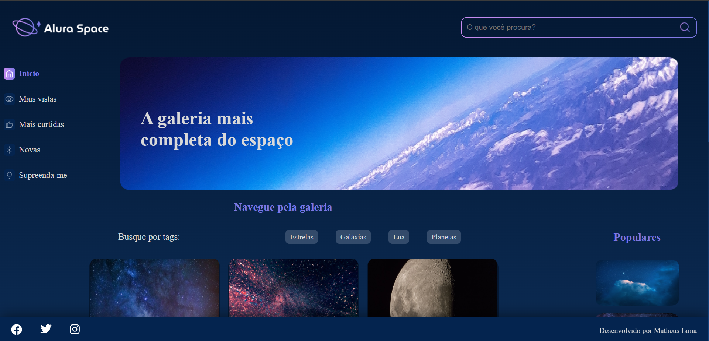
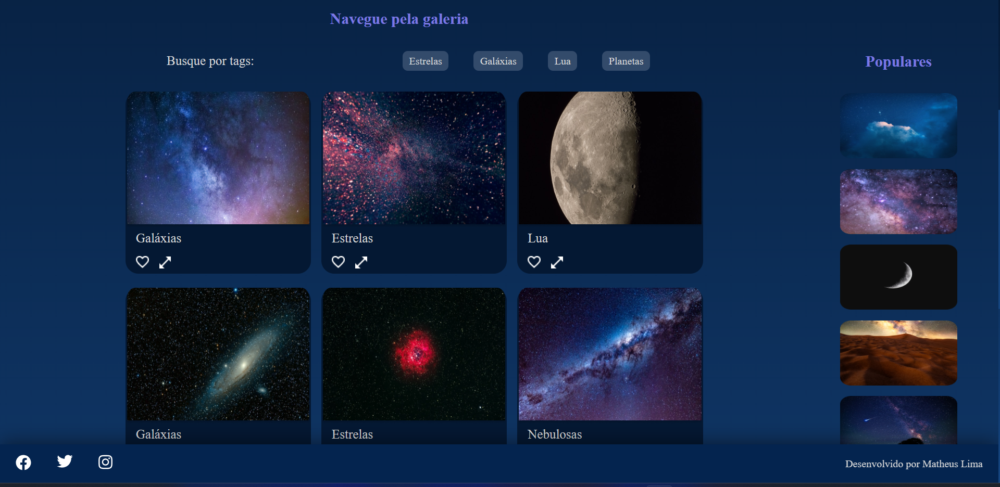

# WebSite AluraSpace

| :placard: Vitrine.Dev | Matheus da Trindade Lima |
| -------------  | --- |
| :sparkles: Name        | **WebSite AluraSpace**
| :label: Technologies | React, Sass
| :bulb: Skills        | Posicionamento de elementos, Trabalhando com o React e entendendo a importância de utilizar os pré-processadores css.

# WebSite AluraSpace
<p>
  Nesse projeto realizado junto com a plataforma alura, realizei diversas tarefas, entretando o ponto crucial desse projeto foi de alguma forma se familiarizar cada vez mais com React, entendendo todo o seu real pontêncial, sua importância e revolução que o mesmo trouxe e ainda continua trazendo no desenvolvimento web num geral.
</p>

<p>
  No site encontra-se uma página web estática feita com a tecnologia informada acima. Trabalhando no mesmo com habilidades de posicionamento de elementos, layout fixos, utilizando o flexbox.
</p>

<p>
  Contém também toda a parte de estruração do projeto, antes mesmo de colocar a mão na massa, como por exemplo: fazer um planejamento antes mesmo de começar, separando arquivos, pastas, imagens que posteriormente seriam utilizadas no projeto. 
</p>
<p>
  Separando todo código em uma pasta pai chamada Components, e posteriormente colocando cada componente em sua respectiva pasta, e também a sua estilização, criando assim uma organização melhor, e atendendo as demandas pedidas em um projeto profissional, como por exemplo sempre buscar criar um código e um projeto mais fácil para manutenção futuramente. 
</p>


## Layout web

### Página inicial



Clonar repositório

```bash
  https://github.com/Limatrindade/aluraSpace
```

## Front-end
Pré-requisitos: Navegador

Editar com IDE ou Editor de preferência.

Acessar utilizando navegador de preferência.

## Autor 

Matheus da Trindade Lima

<a href="https://www.linkedin.com/in/matheus-lima-809407191/" target="_blank">
    
</a>

